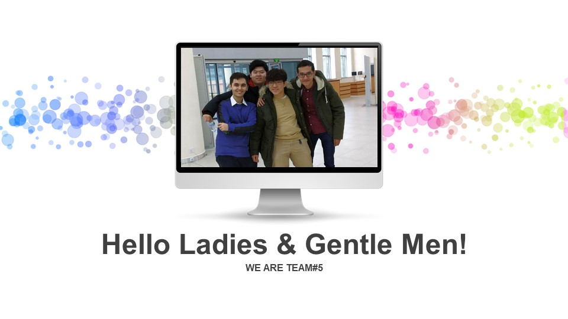
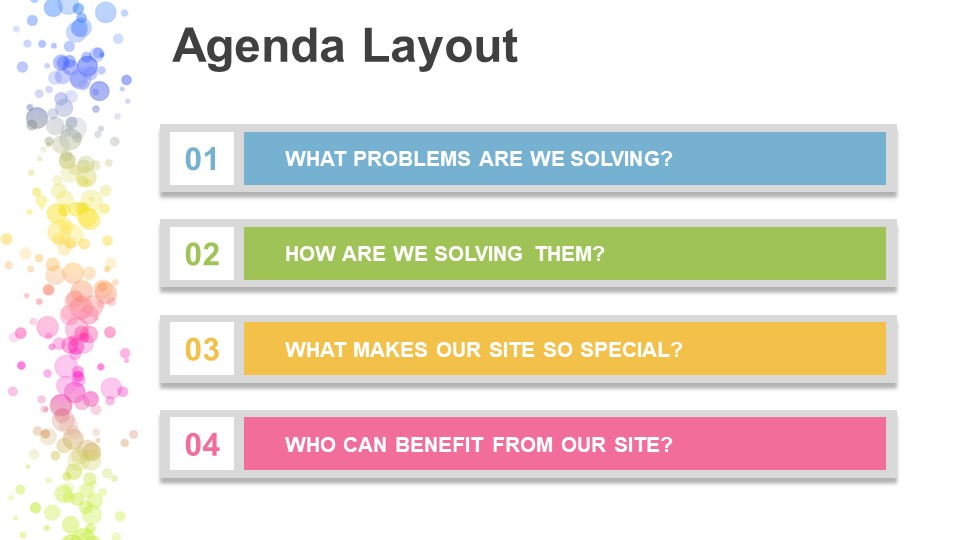
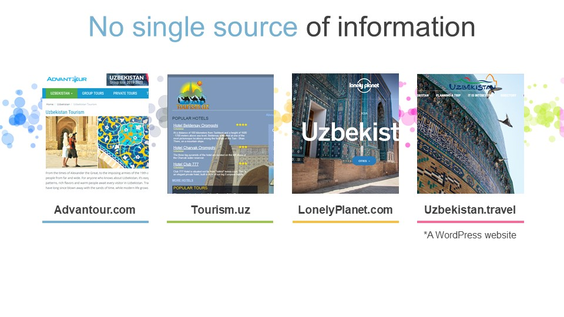
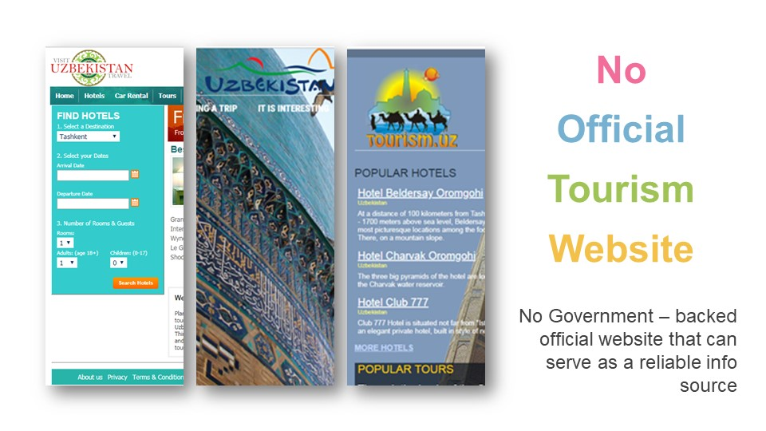
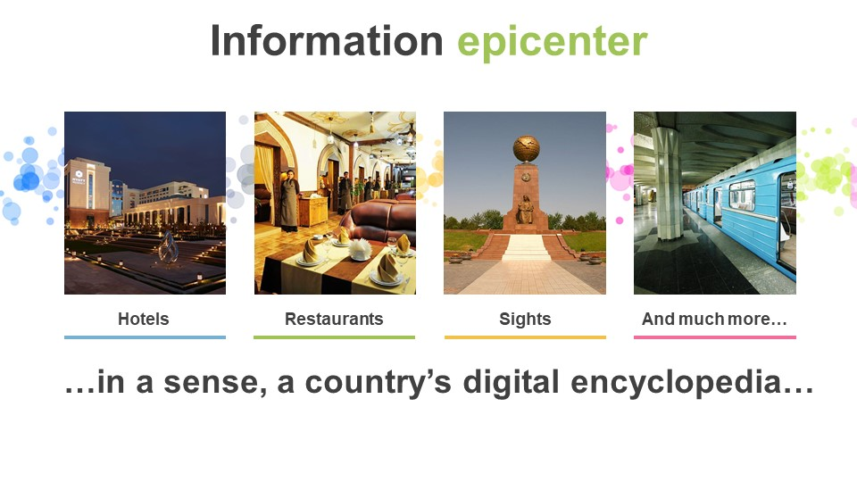
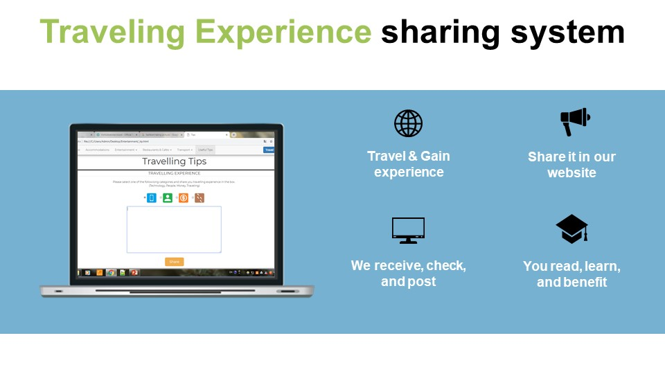
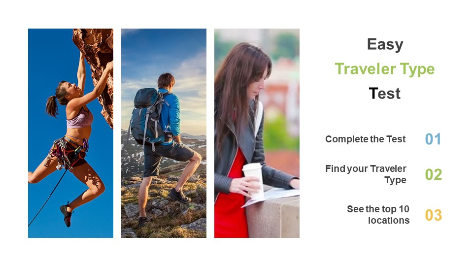
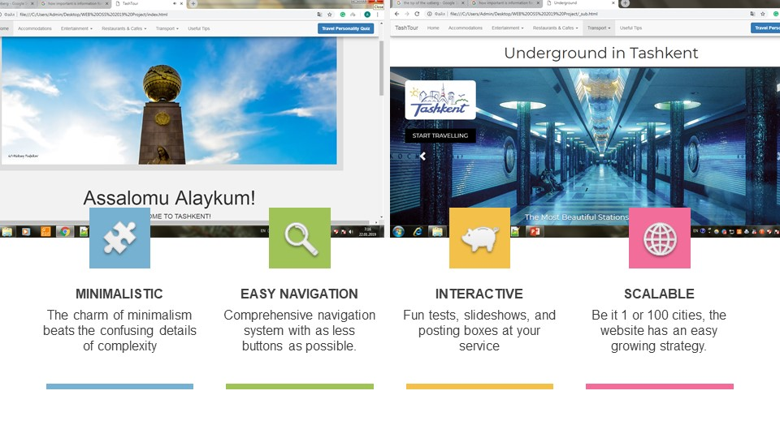
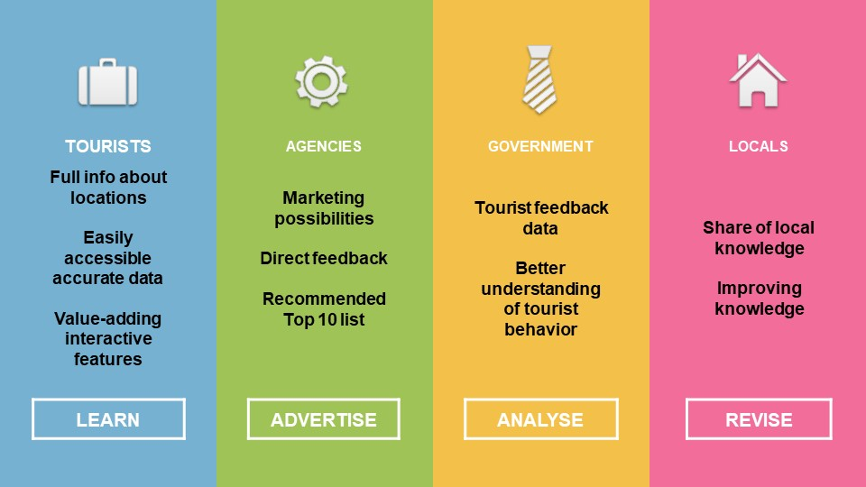

# HTMLProjIUT
- 10일 동안 외국인 비전공자들과 우즈베키스탄에서 진행했던 프로젝트
- 직접 만나서 프로젝트를 usb로 공유하고 하루에 3시간씩 프로젝트 진행을 하였습니다.
- 팀원들이 만든 페이지들을 서로 조합하였기 때문에 파일구조도 엉망이고 커밋로그도 엉망입니다..

# 프로젝트 설명 #
- 시작동기
 우즈베키스탄에서 여행정보들이 난잡하게 분산되있음
 다른사이트들의 관광정보들이 서로 통일되있지 않고 숙박, 식당 등의 가격, 위치정보가 각기 다름
 그래서 팀원들과 같이 믿을 수 있고 쉽고 한눈에 볼 수 있는 우즈벡 관광 웹사이트 제작

- 특징
1. 사용자들의 여행 경험들을 투고할 수 있는 폼 제공
2. 여행자 퀴즈를 통해 사용자에게 맞는 여행지 제공
3. 간단하고 접근성이 좋은 UI
4. 창 사이즈가 변경돼도 적응되는 반응형 웹 UI

# 내가 한 일 #  
- 비전공자 우즈벡 팀원들에게 개발지식을 알려주기  
- bootstrap을 이용하여 레이아웃과 네비게이션바를 제작  
- 팀원들과 우즈벡 관광정보를 수집하여 웹사이트 제작  

# 관련 내용 #

# 수상내역 #
- WEB OPEN SOURCE SOFTWARE PROFESSIONAL TRAINING,1ST Prize
